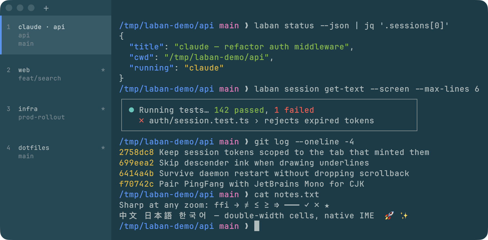

# Laban

**Quit, update, or crash Laban. Your shells continue to run.**

[](https://github.com/rrva/laban/releases/latest)

[](LICENSE)



Laban is a native macOS terminal. A background daemon keeps your shells, not
the window. When you open Laban again, you get the same tabs, processes, and
scrollback. You do not need tmux.

## Main features

- **Shells continue to run.** Quit Laban, update it, or let it crash. Your
  processes continue to run. A restart of the Mac stops them.
- **Agent sessions come back.** Laban finds Claude Code and Codex in your
  tabs. When Laban opens again, it resumes them.
- **Images paste over SSH.** Push ⌘V with a screenshot on the clipboard. In
  an `ssh` session, Laban uploads the image and pastes its path.
- **Agents can read your terminal.** The `laban` CLI lets an agent read a
  session, take a screenshot, or suggest a command. Laban asks you first.
- **Sharp text.** Laban draws text from the font outlines on the GPU. Text
  stays sharp when you zoom. Ligatures are on by default.
- **A native Mac app.** Laban uses AppKit, not Electron. It has vertical
  tabs, split panes, and native text input.
- **CJK and emoji work.** Laban adds a CJK font to JetBrains Mono. Input
  methods such as Pinyin work normally.
- **A modern terminal core.** Laban uses libghostty-vt, the VT core of
  Ghostty. It supports true color, links, the mouse, Kitty graphics, and
  modern key protocols.

[**All features**](docs/features.md) lists many more features and their
shortcuts. Some of these features have no menu item.

> **Status: beta.** APIs, scripts, debug endpoints, and file formats can
> change without notice.

## Install

1. Download `Laban-<version>.dmg` from the
   [latest release](https://github.com/rrva/laban/releases/latest).
2. Open the file.
3. Drag Laban into `/Applications`.

Laban updates itself after that. Laban needs macOS 13 (Ventura) or later.

## Use the `laban` CLI

The `laban` CLI is in `Laban.app/Contents/MacOS`. To add it to your PATH, run:

```sh
laban install-cli
```

To see all the commands, run `laban --help`.

## Documentation

- [All features](docs/features.md): every feature and shortcut.
- [Build, run, and test](docs/building.md): build from source, run without a
  window, and control Laban from scripts.
- [Contributing](CONTRIBUTING.md): how to change Laban.
- [Documentation index](docs/README.md): design decisions and process.

## License

Laban uses the MIT license. See [`LICENSE`](LICENSE).

[`THIRD_PARTY_LICENSES.md`](THIRD_PARTY_LICENSES.md) lists all third-party
components in the app:

- libghostty-vt (Ghostty): MIT license (© 2024 Mitchell Hashimoto, Ghostty
  contributors). The build gets it into `.external/libghostty-vt/` and links
  it statically.
- JetBrains Mono: SIL Open Font License 1.1. See
  [`Sources/LabanRenderer/Resources/JetBrainsMono-OFL.txt`](Sources/LabanRenderer/Resources/JetBrainsMono-OFL.txt).
